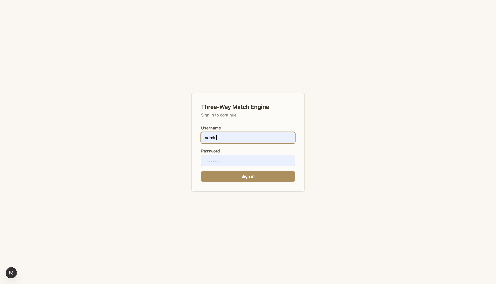
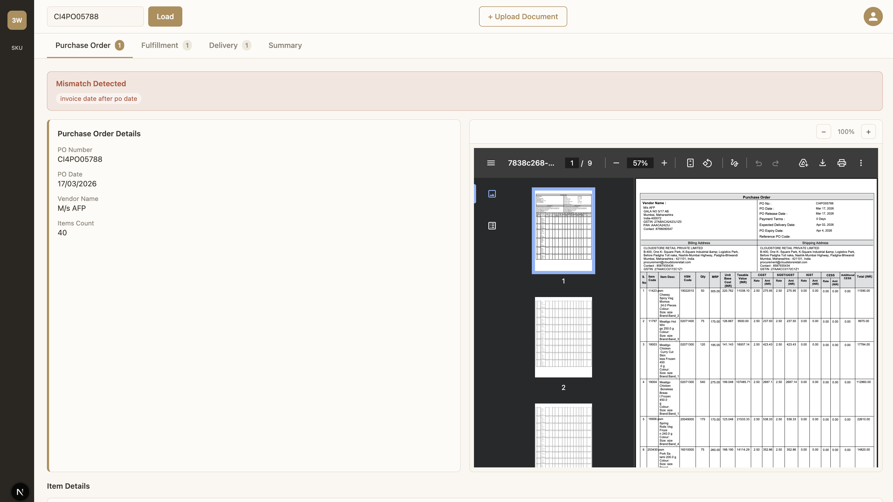
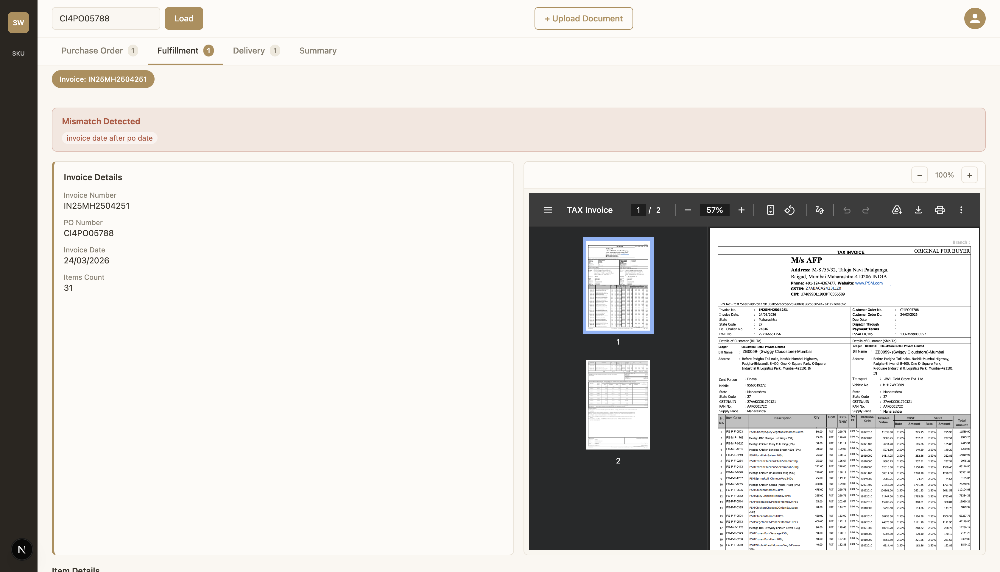
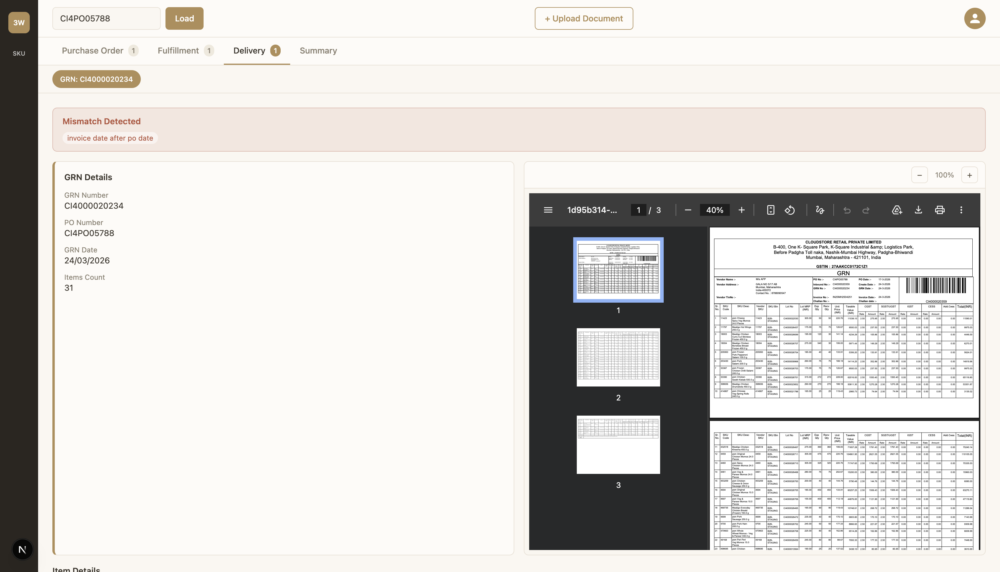
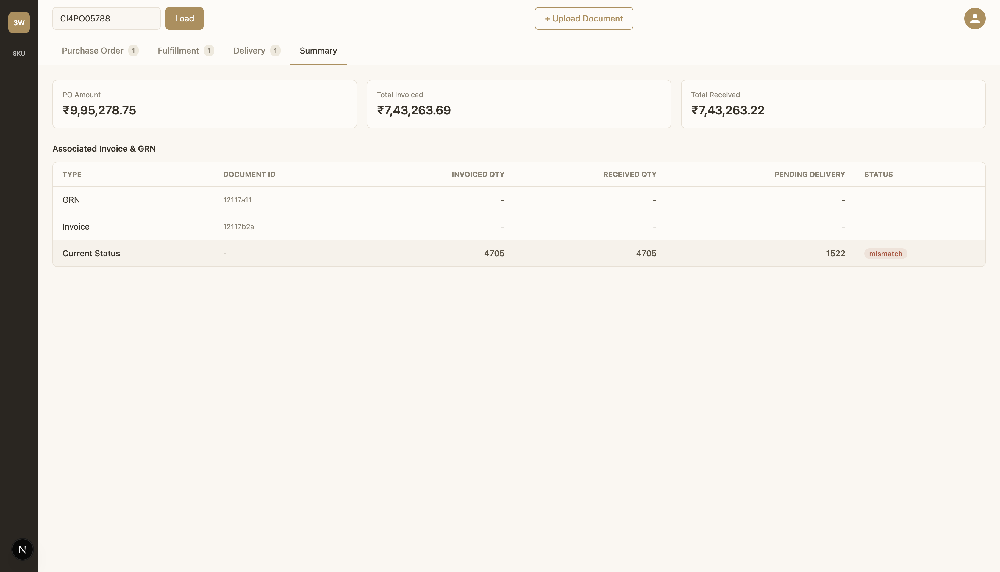
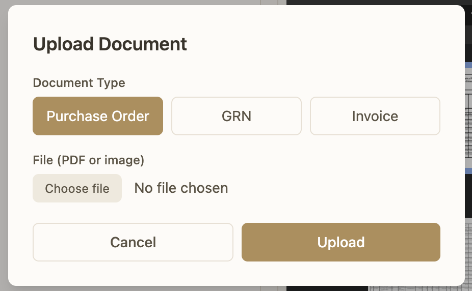
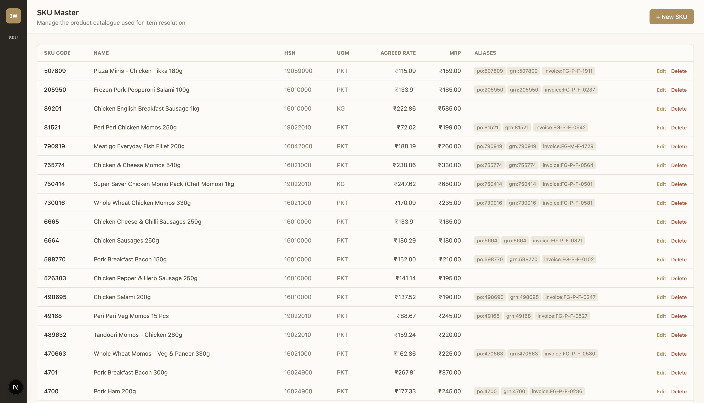
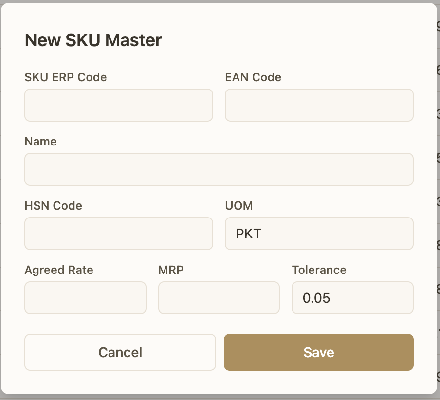
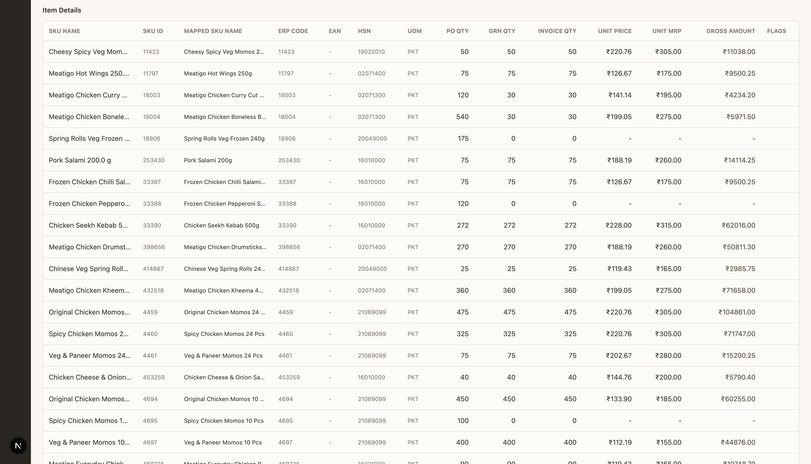

# Three-Way Match Engine

A full-stack procurement reconciliation system that reads Purchase Orders, Goods Receipt Notes, and Invoices, extracts structured data using the Gemini API, resolves line items against a SKU Master catalogue, and performs a live three-way match with reason-coded results.

## Screenshots

All screenshots below are from a live run of the application against the sample PO, GRN, and Invoice documents provided with the assignment, with the SKU Master catalogue fully seeded.

Login screen



Purchase Order detail view, showing the form panel, file preview, and item grid with the mismatch banner



Fulfillment (Invoice) detail view, with the sub-tab pill for switching between multiple invoices



Delivery (GRN) detail view, with the sub-tab pill for switching between multiple GRNs



Summary tab, showing the stat cards and the Associated Invoice and GRN table



Upload document modal



SKU Master list screen



SKU Master create and edit form



Item grid detail, showing all specification-required columns including SKU ID, Mapped SKU Name, ERP Code, EAN, HSN, UOM, and Gross Amount, with mismatched cells highlighted



## Overview

In procurement, a single purchase is described by three separate documents: the Purchase Order (what was ordered), the Goods Receipt Note (what was actually received), and the Invoice (what the vendor is billing for). A three-way match reconciles these three views and surfaces any discrepancies. This system automates that reconciliation end to end: a user uploads a PO, GRN, or Invoice as a PDF or image; the backend extracts structured data using Gemini; each line item is resolved against a SKU Master catalogue; the document is persisted independently of upload order; and the match result is recomputed live, on every read, from whatever documents currently exist for that PO number.

## Tech Stack

Backend: Node.js, Express, MongoDB with Mongoose, Gemini API (via the `@google/genai` SDK), Multer for file uploads, JWT for auth tokens.

Frontend: Next.js (App Router), TypeScript, Tailwind CSS, TanStack Query.

## Setup and Run Steps

### Prerequisites

Node.js 18 or later, a MongoDB Atlas cluster (or local MongoDB instance), and a Gemini API key.

### Backend

```bash
cd backend
npm install
cp .env.example .env
```

Fill in `.env` with your own values:

```
PORT=5050
MONGODB_URI=your_mongodb_connection_string
JWT_SECRET=any_long_random_string
GEMINI_API_KEY=your_gemini_api_key
STATIC_LOGIN_USERNAME=admin
STATIC_LOGIN_PASSWORD=admin123
```

Start the server:

```bash
npm run dev
```

The API runs on `http://localhost:5050` by default. Port 5050 was chosen deliberately; on macOS, port 5000 is reserved by the AirPlay Receiver service and will silently conflict with a Node server bound to it.

### Frontend

```bash
cd frontend
npm install
```

Create `.env.local`:

```
NEXT_PUBLIC_API_URL=http://localhost:5050
```

Start the dev server:

```bash
npm run dev
```

The app runs on `http://localhost:3000`. Log in with the credentials set in the backend `.env`.

### Seeding SKU Master data

The repository includes `backend/src/utils/seedSkuMaster.js`, which populates the SKU Master catalogue with the 40 line items from the sample PO used during development, using the PO's own `Unit Base Cost` and `MRP` columns as the source of truth for `agreedRate` and `mrp`. Run it once after the backend is connected to MongoDB:

```bash
cd backend
node src/utils/seedSkuMaster.js
```

This script exists purely to bootstrap demo data; in a real deployment, the SKU Master catalogue is expected to be populated and maintained independently through its own CRUD screen, described further under Assumptions below.

## Gemini Configuration

Document extraction uses the Gemini API through the `@google/genai` SDK, calling `generateContent` with the raw PDF or image bytes passed as `inlineData` alongside a document-type-specific text prompt.

During development, the project moved through several model names as Google deprecated or restricted access to earlier ones: `gemini-2.0-flash` was retired; its suggested replacement `gemini-2.5-flash` returned a 404 for new API keys; the SDK itself was also migrated from the now-legacy `@google/generative-ai` package to the actively maintained `@google/genai` package, since the older package could not correctly transmit PDF bytes as inline document data. The model currently in use is `gemini-3.5-flash-lite`, which was found to reliably extract multi-page tabular PDFs within the free-tier quota. If Gemini's servers return a transient 503 (a documented, widespread high-demand condition on free-tier flash models), the extraction service retries automatically with exponential backoff before failing the upload with a clear error.

Three separate prompts are used, one per document type, each describing the exact JSON shape expected and calling out format quirks specific to that document type: the PO's item codes are sometimes blank for certain rows; the GRN has two distinct quantity columns (`Exp Qty` and `Recv Qty`) that must not be confused; and Invoices frequently omit an MRP column entirely, which should be returned as `null` rather than fabricated.

## Approach and Data Model

The data model follows the assignment specification directly, with one addition. `SkuMaster` carries the required fields (`skuErpCode`, `name`, `eanCode`, `hsnCode`, `uom`, `agreedRate`, `mrp`, `priceTolerance`) plus an `aliases` array of `{ source, code }` pairs, where `source` is one of `po`, `grn`, or `invoice`.

This addition exists because the sample documents used three genuinely different code schemes for the same physical product: the PO's item code was often blank or inconsistent; the GRN used a numeric internal SKU code (for example, `11423`); and the Invoice used a distinct vendor-facing code (for example, `FG-P-F-0503`). A single `skuErpCode` field cannot resolve all three simultaneously, so each SkuMaster record can carry a small alias per document type in addition to its canonical `skuErpCode`, which is treated as the GRN's numeric code by convention in this dataset.

`PurchaseOrder`, `Grn`, `Invoice`, and `MatchAudit` follow the specification's fields exactly, each retaining the untouched `rawParsed` output from Gemini for debugging without needing to re-upload the source file.

## Parsing Flow

A document is uploaded with a `documentType` of `po`, `grn`, or `invoice`. The raw file is saved to local disk via Multer, then sent to Gemini with the matching prompt. The returned text is stripped of markdown code fences and parsed as JSON. The result is validated against the minimum required fields for that document type; if validation fails, the extraction is retried once, and if it still fails, the upload is rejected with a clear error message rather than persisting a partial or malformed document. On success, master resolution runs against every line item, then the document is persisted independently of whether a corresponding PO record already exists, and a duplication check runs immediately afterward. Every step is logged to `MatchAudit` for traceability.

## Matching Key Rationale

The resolved `SkuMaster._id` is used as the primary matching key across all three documents wherever resolution succeeds. Master resolution runs in this order: match by `skuErpCode` against the incoming `itemCode` (case-insensitive, whitespace-trimmed); if that fails, check the document-type-specific `aliases` entry; if that also fails, fall back to `eanCode`. If none of these resolve, the item is never dropped; it is stored with `skuMaster` left unset and flagged with `unmapped_master_sku`, and it falls back to a normalised raw `itemCode` (or description, if the code itself is empty) as its aggregation key so it still appears, visibly, in the item grid and in mismatch reasoning.

This design was validated directly against the assignment's own sample documents, which happen to use three distinct code schemes for the same products across PO, GRN, and Invoice; a naive `skuErpCode === itemCode` comparison across all three would have failed to resolve the majority of line items.

## Matching Logic

`GET /match/:poNumber` recomputes the full match on every call directly from whatever PurchaseOrder, Grn, and Invoice documents currently exist for that PO number; nothing is cached or stored as a stale status field. If the full set of PO, at least one GRN, and at least one Invoice is not yet present, the status returns `insufficient_documents` without treating any missing document type as zero quantity.

Once all three types are present, quantities and prices are aggregated per resolved item across all GRNs and all Invoices linked to that PO, and each of the specification's reason codes is evaluated: `grn_qty_exceeds_po_qty`, `invoice_qty_exceeds_grn_qty`, `invoice_qty_exceeds_po_qty`, `invoice_date_after_po_date`, `duplicate_po`, `duplicate_document`, `item_missing_in_po`, `price_mismatch`, `mrp_mismatch`, and `unmapped_master_sku`. Price and MRP comparisons respect each SkuMaster's own `priceTolerance` and skip the comparison entirely when a rate or MRP is missing, rather than treating an absent value as a mismatch; a zero or invalid `agreedRate` is guarded against to avoid a divide-by-zero. The final status rolls up in the specification's stated priority order: any hard violation produces `mismatch`; no hard violations but the presence of a soft warning or unreconciled quantity produces `partially_matched`; full reconciliation with zero reasons produces `matched`.

## Out-of-Order Handling

Documents are linked purely by the `poNumber` string, never by a foreign key to an existing PurchaseOrder record. Every document type is validated and persisted independently the moment it is uploaded, regardless of whether a PO with that number exists yet. This was verified directly: uploading a GRN or Invoice before its corresponding PO succeeds and is stored correctly; the match endpoint simply reports `insufficient_documents` until the full set exists, then resolves correctly as soon as it does, with no reprocessing step required.

## Duplicate Handling

A second PurchaseOrder uploaded for a `poNumber` that already has one is still stored, never overwritten, and is surfaced through the `duplicate_po` reason code on the next match computation. A second GRN or Invoice reusing an existing `grnNumber` or `invoiceNumber` under the same `poNumber` is handled the same way and surfaced as `duplicate_document`. Both checks run immediately after persistence and are recorded to the audit log.

## Frontend Architecture and State Management

The frontend is built with Next.js App Router and TypeScript. TanStack Query was chosen over Redux Toolkit because the backend is the single source of truth for nearly all state in this application; there is very little client-only UI state that needs a global store. TanStack Query provides automatic caching, request deduplication, and straightforward invalidation (for example, invalidating the `documents` and `match` queries the moment an upload succeeds, so the UI reflects the new document without a manual refresh), which maps directly onto this application's read-heavy, server-driven nature.

The app shell follows the reference screenshots: a static left icon rail, top tabs for Purchase Order, Fulfillment, Delivery, and Summary, each with a live count badge, and sub-tab pills within Fulfillment and Delivery for switching between multiple Invoices or GRNs. Each document detail view follows the same layout: a bordered form panel with a colored left accent bar and a mismatch banner where applicable, a file preview panel with basic zoom controls, and a full-width item grid below showing SKU Name, SKU ID, Mapped SKU Name, ERP Code, EAN, HSN, UOM, quantity columns across all three documents, Unit Price, Unit MRP, and Gross Amount, with mismatched cells highlighted and unmapped items visibly flagged rather than hidden.

The visual design uses a warm, cream-toned color palette rather than a stock gray or white theme, and the layout is responsive down to mobile widths.

## Assumptions

Local disk storage is used for uploaded files, consistent with the assignment's stated assumption that cloud blob storage is out of scope. Authentication is a single static username and password exchanged for a signed JWT; there is no real identity provider. The SKU Master catalogue is treated as data that a procurement or operations team maintains independently through its own CRUD screen, before or alongside document uploads; the seed script included in this repository exists only to bootstrap a working demo dataset from the sample PO provided with the assignment, since no separate authoritative master catalogue was supplied.

## Tradeoffs

Master resolution performs a full scan of the SkuMaster collection per item rather than a single indexed batch lookup; this was a deliberate simplicity tradeoff appropriate for a catalogue of this size within a five-to-six day assignment, and would need to be revisited with proper indexing on `aliases.source` and `aliases.code` at a larger scale, both of which are already indexed in the schema in anticipation of this. The matching engine aggregates and evaluates reason codes in a single pass through plain functions, per the assignment's explicit guidance against building an engine or plugin abstraction for this scope.

## Known Limitations

The `invoice_date_after_po_date` rule is applied literally, exactly as specified; in the sample dataset this rule fires even though the invoice date follows the PO date by a normal, expected delivery lag of about a week, which is standard in real procurement timelines. A stricter real-world rule would likely compare the invoice date against the expected delivery date rather than the PO date itself, but the specification's rule was implemented as written.

Onboarding a genuinely new vendor or product line with no existing SKU Master coverage requires manually creating each master record through the SKU Master screen before its items will resolve; there is no automatic suggestion or fuzzy matching between a new item's description and existing master records. This is expected behavior consistent with the specification, which explicitly requires unresolved items to remain visible as warnings rather than be dropped or guessed at, but it does mean the first upload for a new vendor will show every line item as unmapped until the catalogue catches up.

The Summary tab's stat cards compute PO Amount, Total Invoiced, and Total Received from the resolved item set; an item that fails to resolve to any SkuMaster record and also carries no rate information from its own document will not contribute to these totals, which is a reasonable default but worth stating explicitly.

## What Would Be Improved With More Time

A fuzzy-matching or embedding-based suggestion step during SKU Master onboarding, so that a new item's description could be matched against existing master names as a starting suggestion rather than requiring a fully manual lookup. Batch or indexed master resolution instead of a per-item collection scan, for catalogues significantly larger than this assignment's dataset. Real, granular upload progress reflecting actual backend pipeline stages (uploading, parsing, mapping, matched) rather than a single loading state, which was listed as an optional bonus. Swagger or OpenAPI documentation alongside the Postman collection already included.

## AI Tools Used

Claude was used for creating the SKU Master seed data, debugging issues across the backend and frontend, writing and refining the API endpoints, and improving the matching and master-resolution logic. Gemini was used as the document extraction engine within the application itself, per the assignment's required stack.

## API Documentation

A Postman collection covering all required endpoints is included at `docs/Three-Way-Match-Engine.postman_collection.json`. It includes a pre-configured login request that automatically stores the returned token for use in every subsequent request in the collection.

## Sample Outputs

Saved example outputs from a real run of the system are included under `docs/sample-outputs/`: a raw Gemini extraction result for the sample Purchase Order (`parsed-po-extraction.json`), a full `GET /match/:poNumber` response (`match-response.json`), and a full `GET /summary/:poNumber` response (`summary-response.json`).
